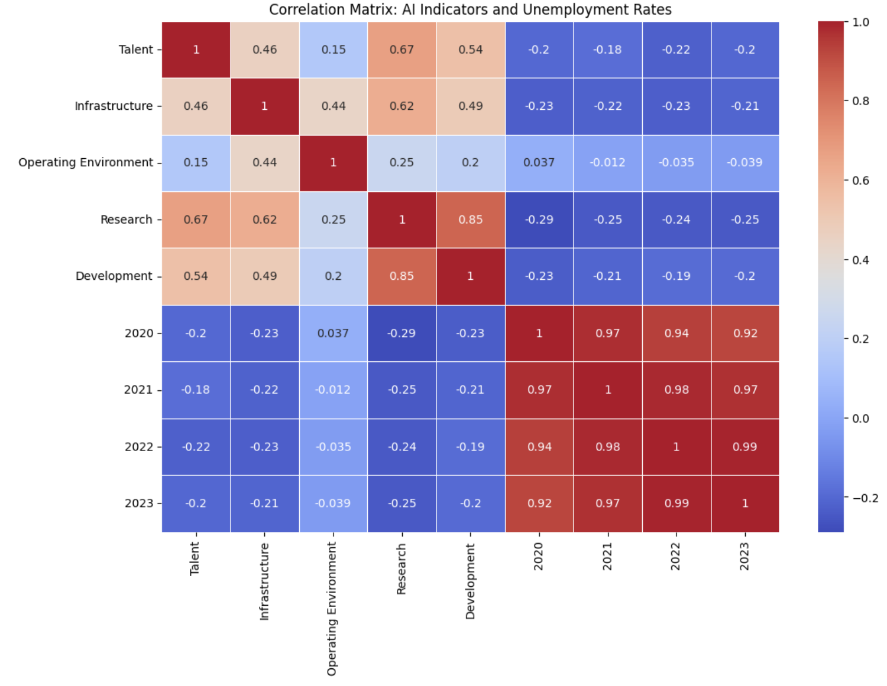
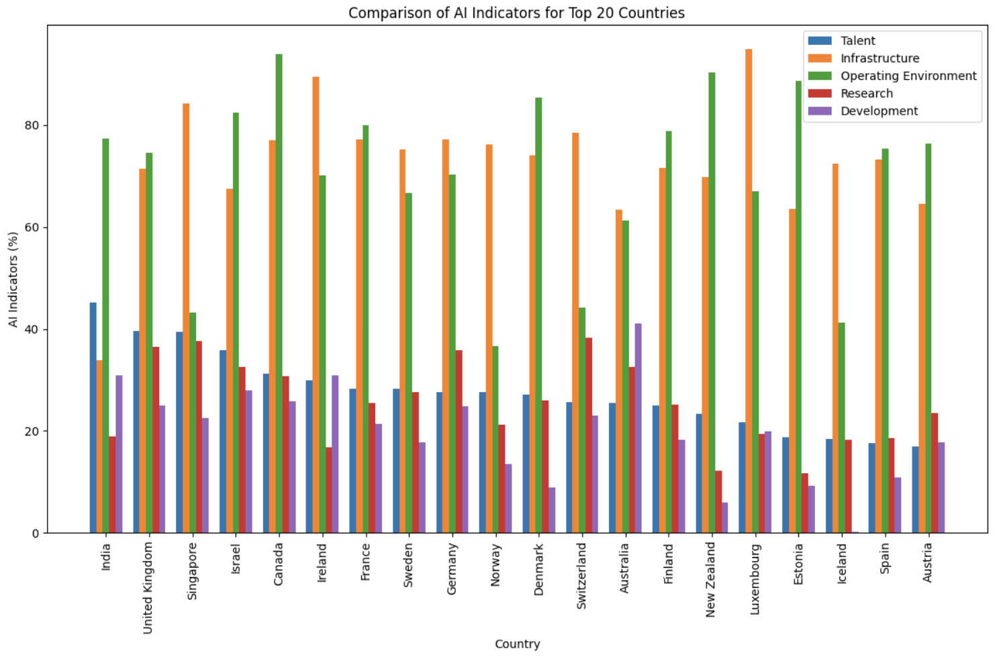
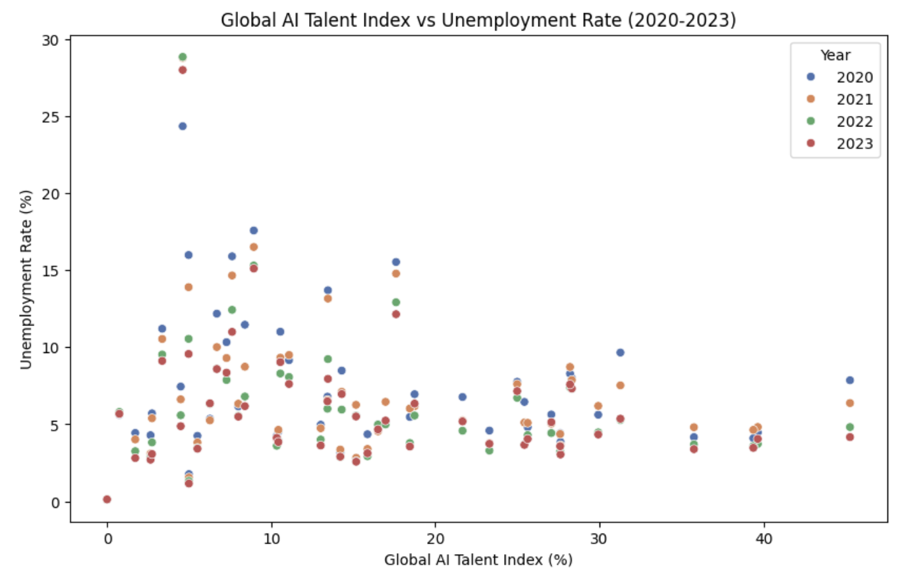
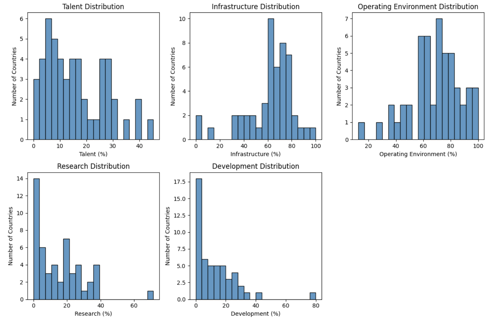

# **AI Talent vs Unemployment: Navigating the Future of Work**

Artificial Intelligence (AI) is changing how industries work, how economies grow, and how jobs evolve. As countries push forward with their AI capabilities, one important question remains: **How does AI affect jobs?** This report looks into the connection between **AI adoption** and **unemployment rates**, showing how nations with strong AI skills manage their job markets better.

## Target Audience

This report is aimed at **job seekers**, **AI enthusiasts**, and **curious professionals** who want to know how AI is shaping the job market. Whether you are in tech or not, AI impacts everyone’s future. Understanding these trends can help you make informed career choices in the fast-evolving world of AI.

---

## 1. Correlation Between AI and Unemployment

This heatmap shows the connection between different AI indicators (like **AI Talent**, **Infrastructure**, **Research**, etc.) and **unemployment rates** from 2020 to 2023.

- **Key Takeaways**:
  - **AI Talent reduces unemployment**: Countries with more **AI Talent** tend to have **lower unemployment rates**. This suggests that a strong AI workforce helps countries handle the impact of automation on jobs.
  - **Infrastructure isn't everything**: While **Infrastructure** is important for AI deployment, its direct link to unemployment is weaker. This indicates that having the right talent is more crucial than just having good infrastructure.
  - **Research & Development**: Countries with better **AI research** and **development** environments also tend to see more stable unemployment rates, especially during global challenges like the pandemic.

---

## 2. AI Capabilities Across Top 20 Countries

This bar chart compares the AI indicators across the top 20 countries. It shows how different countries perform in terms of **AI Talent**, **Infrastructure**, **Operating Environment**, **Research**, and **Development**.

- **Key Takeaways**:
  - **Balanced countries**: Nations like **Germany**, **United Kingdom**, and **Singapore** have balanced AI indicators, making them well-equipped to handle the changes brought by AI.
  - **Talent Leaders**: **India** and **Israel** rank high in **AI Talent** but have lower scores in **Research** and **Development**. This might limit their future competitiveness.
  - **Infrastructure Leaders**: **Australia** and **Norway** have strong **Infrastructure** but lower **AI Talent**, which could slow down their ability to maximize AI’s potential.

---

## 3. Global AI Talent vs. Unemployment (2020-2023)

This scatter plot shows the relationship between the **Global AI Talent Index** and **unemployment rates** from 2020 to 2023. Each point represents a country, and different colors represent the years.

- **Key Takeaways**:
  - **Low AI Talent, High Unemployment**: Countries with less than 10% AI talent tend to have high unemployment rates, some reaching up to **30%**.
  - **Higher Talent, Lower Unemployment**: Countries with **20% or more AI Talent** consistently show lower unemployment rates, around **5% to 10%**.
  - **Resilience During the Pandemic**: Despite the global economic downturn from 2020 to 2023, countries with stronger AI Talent showed more stable unemployment rates, proving the value of an AI-skilled workforce.

---

## 4. Distribution of AI Indicators Across Countries

These histograms show how countries perform in different AI categories, including **Talent**, **Infrastructure**, **Operating Environment**, **Research**, and **Development**.

- **Key Takeaways**:
  - **AI Talent**: Most countries have less than **20% AI Talent**, meaning there’s still room for growth in AI skills globally.
  - **AI Infrastructure**: Many countries have invested heavily in infrastructure, with most scoring between **60% and 80%**.
  - **AI Research & Development**: Fewer countries are making significant investments in **AI Research and Development**, which could limit long-term innovation.

---

## Conclusion: Why AI Talent Matters

From the analysis, one clear message emerges: **AI Talent is key to managing unemployment**. Countries that invest in building a skilled AI workforce are more likely to see lower unemployment rates, even during challenging times like the global pandemic. 

### Key Recommendations:
- **Invest in AI Skills**: Countries should prioritize education and training to build AI expertise. Having a workforce skilled in AI is crucial to staying competitive and keeping unemployment low.
- **Balance AI Investments**: Countries with strong **Infrastructure** but weak **Talent** or **Research** need to balance their AI strategy to ensure they reap the benefits of technology.
- **Future-Proof the Workforce**: As AI continues to disrupt industries, job seekers should focus on gaining AI-related skills to stay relevant in the changing job market.

---

## Resources

- **World Bank - Unemployment Data**: [Unemployment, total (% of total labor force) (modeled ILO estimate)](https://data.worldbank.org/indicator/SL.UEM.TOTL.ZS)
- **Kaggle - AI Global Index**: [AI Global Index Dataset](https://www.kaggle.com/datasets/katerynameleshenko/ai-index)

---

This report provides valuable insights for anyone curious about how AI is shaping the future of work. Whether you’re a job seeker, business leader, or just someone interested in AI, these findings can help you understand where the world is heading and how to prepare for it.
